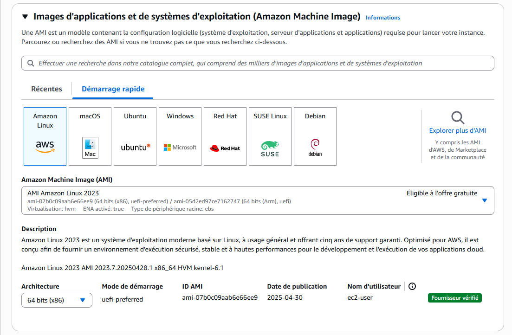
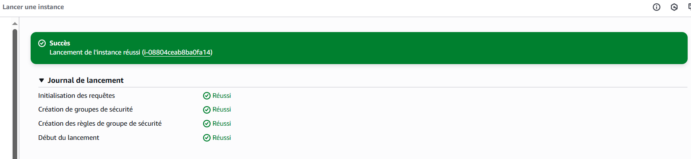
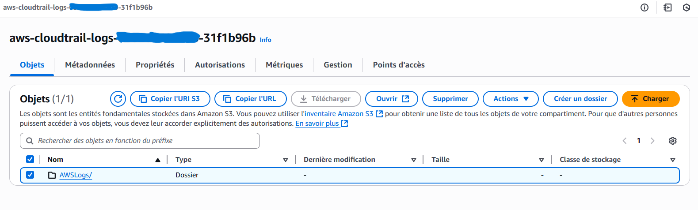

# 🛡️ Projet AWS : Mise en place d’un système d’alerte CPU avec AWS EC2, S3, CloudWatch, CloudTrail et SNS 

## Objectif 🎯
Mettre en place une infrastructure sécurisée avec une instance EC2, supervisée par CloudWatch, audité avec CloudTrail, et avec des alertes via SNS. Ce lab fait partie de la préparation à la certification AWS Solutions Architect Associate (SAA) tout en respectant les limites du Free Tier.

## Architecture du système


## Services AWS Utilisés 🧩
- **EC2** : Instance hébergeant une application
- **IAM** : Attribution de rôle à l'instance
- **CloudWatch** : Suivi des métriques, journaux, alarmes
- **SNS** : Notifications par email en cas de seuil dépassé
- **CloudTrail** : Suivi des appels API AWS
- **Security Groups** : Contrôle des accès réseau à l’instance EC2 

## Étapes 1 Création de l’instance EC2 🛠️
1. Amazon Linux 2
2. Type : t2.micro (Free Tier)
3. Groupe de sécurité :
   * Port 22 : autoriser uniquement ton IP
   * Port 80 : autoriser tout le monde pour accès HTTP
4. Dans Détails avancés > Données utilisateurs colle le script ci-dessus pour l’installation et configuration de l’agent CloudWatch, puis clique sur Lancer l’instance.

```
#!/bin/bash
# Mise à jour du système
yum update -y

# Installation de l'agent CloudWatch
yum install -y amazon-cloudwatch-agent

# Création du fichier de configuration CloudWatch agent
cat <<EOF > /opt/aws/amazon-cloudwatch-agent/bin/config.json
{
  "agent": {
    "metrics_collection_interval": 60,
    "logfile": "/opt/aws/amazon-cloudwatch-agent/logs/amazon-cloudwatch-agent.log",
    "run_as_user": "root"
  },
  "metrics": {
    "append_dimensions": {
      "InstanceId": "\${aws:InstanceId}"
    },
    "metrics_collected": {
      "cpu": {
        "measurement": [
          "cpu_usage_idle",
          "cpu_usage_user",
          "cpu_usage_system"
        ],
        "metrics_collection_interval": 60,
        "totalcpu": true
      },
      "mem": {
        "measurement": [
          "mem_used_percent"
        ],
        "metrics_collection_interval": 60
      }
    }
  },
  "logs": {
    "logs_collected": {
      "files": {
        "collect_list": [
          {
            "file_path": "/var/log/messages",
            "log_group_name": "/ec2/messages",
            "log_stream_name": "{instance_id}"
          }
        ]
      }
    }
  }
}
EOF

# Lancer l'agent CloudWatch avec la configuration
/opt/aws/amazon-cloudwatch-agent/bin/amazon-cloudwatch-agent-ctl \
  -a fetch-config \
  -m ec2 \
  -c file:/opt/aws/amazon-cloudwatch-agent/bin/config.json \
  -s

```








## Étapes 2 Créer et attacher un rôle IAM pour EC2 avec les permissions CloudWatch🛠️
1. Nom : EC2CloudWatchRole
2. Politique attachée : CloudWatchAgentServerPolicy
3. Attacher le rôle EC2CloudWatchRole à ton instance EC2


## Étapes 3 Créer un journal CloudTrail avec stockage dans un bucket S3
1. Nom du journal : MySecurityTrail
2. Activer CloudWatch Logs
3. Nom du nouveau rôle IAM : RoleCloudTrailForLogsCloudWatch
4. Activité d'API : Lecture et écriture.
5. Vérifier que les journaux sont bien collectés et stockés dans le bucket S3
6. Vérifier que le groupe de journaux a été créer 





## Étapes 4 Créer une alarme CPU CloudWatch avec notification SNS
1. Alarme CPU CloudWatch :
   * Nom de l'alarme : CPUUtilizationAlarm
   * Nom de la métrique : IncomingLogEvents
   * Statistique : Moyenne 
   * Période : 1 min
   * Type de seuil : Statique
   * Seuil : CPU > 10% 
   * Déclencheur d’état d’alarme : En alarme
2. Créer un topic SNS + abonnement email
3. Lier l’alarme CloudWatch à ce topic
4. Vérifier que le topic SNS et l’alarme CloudWatch ont été créer.


## Étape 5 Test et validation
1. Connecte-toi à ton instance EC2
2. Installe et lance l’outil de charge stress en exécutant les commandes suivantes :

```
sudo yum install -y stress
stress --cpu 1 --timeout 300
```
3. Vérifie le déclenchement de l’alarme et la réception de l’e-mail :
   * Ton alarme devrait passer brièvement à l'état ALARM, puis retourner à OK
   * Tu dois recevoir une notification SNS par mail
4. Vérifie le stockage des fichiers journaux dans ton bucket S3


🛠️ Défis rencontrés & solutions apportées :
❌ Erreur AlarmActions must not contain repeats → ✅ Résolue en supprimant l’action SNS en double.

⚠️ Mauvaise métrique sélectionnée → ✅ Corrigé après analyse du comportement de l’alarme.

⏳ Délai inattendu dans la réception de l’e-mail d’alerte → ✅ Observation du comportement de propagation des alarmes CloudWatch.

🔁 Sujet SNS désactivé automatiquement → ✅ Réactivation manuelle via le lien "Resubscribe" reçu par e-mail.

🤔 Absence d'action affichée dans CloudWatch malgré alarme active → ✅ Vérification et réassociation manuelle du sujet SNS.

## Résultat ✅
- Surveillance active des performances EC2
- Notifications automatiques en cas de surcharge
- Journalisation des actions AWS via CloudTrail
- Surveillance via CloudWatch Logs
- Stockage des logs CloudTrail dans le bucket S3

## 📸 Démo
[Dossier img](img) contenant les preuves de test (captures d’écran)

## 📄 Rapport complet
📄 [Télécharger le rapport PDF complet](docs/rapport-lab.pdf)

## 👤 Auteur
**France Stanislas Bantantoula Koudissa**  
Etudiant en Master Génie Informatique  
🔗 [LinkedIn](https://ci.linkedin.com/in/france-stanislas-bantantoula-koudissa-30245b254)

